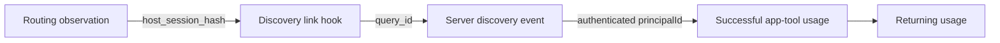

# A smaller telemetry design for PR 11

Research date: 2026-09-16. Recommendation, not an implementation.

Reviewed PR 11 at `d4758d5b98337461888367d30db3929f55921869`, the Obsidian project index and related Agent Context notes, and local monorepo source at `1fe236ae3b2db276e67964be2b7f49eed7557abf`. Local source establishes implementation behavior, not production deployment or enabled analytics configuration. No live host conformance tests or production analytics queries were run.

## Recommendation

Make the gateway the owner of activation, execution outcomes, and retention. Give ordinary MCP requests a static plugin source/version marker. Keep a small hook stream for routing observations and, where verified, connect it to server events through the `query_id` already returned by `Arcade_SelectTools`.

This answers two separate questions: “Which plugin-connected accounts activate and return?” and “What happened between routing guidance and discovery in an observed chat?” It avoids building a local proxy, a new collector, a device identity, or another tool-outcome classifier.

## What PR 11 currently buys us

The current head defaults telemetry on, with explicit opt-out. Its title/body still describe opt-in. Teal explicitly requested opt-out in the review, so retain that preference. [PR 11](https://github.com/ArcadeAI/arcade-plugin/pull/11), [opt-out request](https://github.com/ArcadeAI/arcade-plugin/pull/11#discussion_r4028653621)

The implementation has useful payload allowlisting and bounded input handling. Its main weaknesses are architectural:

- Its identity is a hash of a host session, with no Arcade principal. It cannot measure account retention or join to authenticated gateway events as written. Missing session IDs generate a fresh random identity for each event.
- It duplicates server tool analytics and guesses outcomes from several host-specific response shapes. Missing/unrecognized response data defaults to success. The gateway already has explicit `executed`, `auth_required`, and `error` classifications.
- `normalizeArcadeToolName` accepts `Arcade_…` names; it is not a general observer of every app tool exposed by the gateway.
- Each capture spawns a detached Node process and sends one HTTP request. Session startup sends two captures; an ordinary nonempty prompt sends two. Delivery is best effort with no delivery acknowledgement, so these events cannot establish complete denominators.
- Emitting routing text proves only that the hook produced it. It does not prove that a skill activated, that the host used the text, or that routing caused the eventual tool call.

Sources: [PR telemetry implementation](https://github.com/ArcadeAI/arcade-plugin/blob/d4758d5b98337461888367d30db3929f55921869/hooks/telemetry.mjs), [sender](https://github.com/ArcadeAI/arcade-plugin/blob/d4758d5b98337461888367d30db3929f55921869/hooks/telemetry-send.mjs), [prompt hook](https://github.com/ArcadeAI/arcade-plugin/blob/d4758d5b98337461888367d30db3929f55921869/hooks/user-prompt-submit.mjs), [server outcome definitions](/Users/teal/workspace/arcade/monorepo/apps/engine/internal/analytics/events.go:21).

## 1. Attribute existing gateway events to the plugin

Add proposed static headers to the plugin's MCP configuration:

```json
{
  "Arcade-Plugin": "arcade",
  "Arcade-Plugin-Version": "<release version>"
}
```

Normalize them at gateway ingress into `plugin_source` and `plugin_version`, preserving the existing `source` property used by Engine events. Propagate those fields through existing Usage captures on both stateful and stateless MCP paths. Derive host/version from MCP client metadata, not from the plugin marker. Neither marker proves that a skill was used; both are client-declared analytics context, never authorization.

The portable schema permits headers, and Claude documents them. However, PR 11's generator currently projects only the gateway URL into Cursor/Claude configurations: adding headers to the root file alone would silently lose them in those adapters. Update generation and release-version checks together. Verify the installed package in each host, including OAuth and reconnects. Native client configuration support does not prove plugin-loader support. [Portable schema](/Users/teal/workspace/arcade/arcade-plugin/schemas/agent-plugins/1.0.0/mcp.schema.json), [PR generator](https://github.com/ArcadeAI/arcade-plugin/blob/d4758d5b98337461888367d30db3929f55921869/scripts/generate-manifests.mjs), [Claude configuration](https://code.claude.com/docs/en/plugins-reference#mcp-servers)

If a host cannot preserve headers, a gateway-supported non-secret URL marker is a fallback, subject to an OAuth compatibility test. Do not silently infer plugin use from `client_name=cursor` or assume `/mcp/arcade` is exclusively used by the plugin.

Use the existing Usage identity: its PostHog sink uses authenticated `principalId` as `distinct_id`, with customer/tenant/project groups. Do not introduce another identity scheme for the same accounts. Exclude the fallback `system` identity from person-level retention. [Usage sink](/Users/teal/workspace/arcade/monorepo/apps/usage/internal/sink/processor/posthog.go:102)

Define activation as the first successful real app-tool execution through a plugin-marked connection, excluding discovery/status/meta-tool calls. Count auth-required separately. Define retained plugin usage as a later qualifying plugin-marked execution by the same principal. Measure retention anywhere in Arcade separately by removing the later-event source filter. Tool completion is an activation proxy, not proof of task success.

## 2. Join through the response we already have

The earlier Obsidian note proposes putting a host-session hash on outgoing MCP requests. That requires a dynamic per-chat transport contract. A proxy does not automatically solve this: it also needs a reliable way to know which chat originated each request, including concurrent chats sharing a connection.

There is a smaller candidate in the current source:

1. `Arcade_SelectTools` returns `query_id` in its output.
2. Engine's `tr_select_tools` event records that same ID.
3. A post-tool hook sees both the host session and the returned tool result.
4. That hook can emit one narrow `Plugin discovery linked` event containing `host_session_hash`, `query_id`, `host`, `plugin_version`, and an event ID/time.



This is an analytics join proposal; the arrows do not imply a causal effect from routing.

Sources: [SelectTools output](/Users/teal/workspace/arcade/monorepo/apps/engine/internal/arcadetools/arcadetools.go:340), [discovery capture](/Users/teal/workspace/arcade/monorepo/apps/engine/internal/arcadetools/select_tools_analytics.go:50), [stateless result translation](/Users/teal/workspace/arcade/monorepo/apps/engine/internal/mcpstateless/tools/translate.go:66).

For account attribution, add the returned `query_id` to the existing principal-attributed `MCP tool recommendation queried` Usage event in both MCP paths. That is the preferred owner of the bridge. It currently lacks this property. Alternatively, adding server-derived `principal_id` to `tr_select_tools` can support a property join, but its existing `distinct_id` is project/customer-based and must not be mistaken for a person. Keep the current identity schemes explicit; do not merge project identities into user profiles. [Stateful capture](/Users/teal/workspace/arcade/monorepo/apps/engine/internal/mcp/service.go:1065), [stateless capture](/Users/teal/workspace/arcade/monorepo/apps/engine/internal/mcpstateless/tools/meta.go:139), [analytics identity](/Users/teal/workspace/arcade/monorepo/apps/engine/internal/analytics/capture.go:62)

The server event supplies trusted account identity. The hook supplies untrusted conversation context. Join on the explicit properties in a deduplicated analytical view, rather than aliasing an entire chat into a PostHog person. Conflicting accounts for one chat/query remain ambiguous. Never use a client-submitted query ID as authentication or proof of account ownership.

Host docs make this plausible: Cursor's `afterMCPExecution` exposes `result_json`; Codex's `PostToolUse.tool_response` carries the MCP call result; Claude exposes a tool-specific `tool_response`. Actual envelope preservation, truncation, and nested JSON still need testing on each supported host/version. Extract only the known ID field from the verified SelectTools response shape; never transmit the response envelope. [Cursor hooks](https://cursor.com/docs/hooks#aftermcpexecution), [Codex hooks](https://learn.chatgpt.com/docs/hooks#posttooluse), [Claude hooks](https://code.claude.com/docs/en/hooks#posttooluse-input)

Important limits:

- `query_id` is optional. Condex logging disabled, stopped, failed, or queue-full can produce no ID. Multi-task SelectTools exposes the first available task query ID, so it is not a unique identifier for every recommendation or task.
- A failed first discovery or a chat with no Arcade call may never be linked. Keep those anonymous observations in the denominator; do not label unlinked chats as non-users or failures.
- A direct app-tool call without SelectTools lacks this bridge. Static source markers still attribute its gateway usage.
- `tr_use_tool` can carry the ID echoed by the model, but absent/reused IDs and direct-call paths limit exact discovery-to-execution linkage. Later same-principal usage establishes account retention, not proof it belongs to the same chat.

Sources: [SelectTools aggregation](/Users/teal/workspace/arcade/monorepo/apps/engine/internal/arcadetools/arcadetools.go:405), [async query logging](/Users/teal/workspace/arcade/monorepo/apps/condex/internal/service/selectionlog/async.go:115), [query logging stage](/Users/teal/workspace/arcade/monorepo/apps/condex/internal/service/selection/stages.go:1237), [execution correlation](/Users/teal/workspace/arcade/monorepo/apps/engine/internal/arcadetools/usetool_analytics.go:144).

If the query-ID coverage is insufficient, the next option is a gateway-generated correlation receipt on tool results, independent of selection logging. MCP supports result `_meta`, but hosts may strip it before hooks. That is a separate, bounded compatibility experiment, not a reason to add a proxy now. [MCP result schema](https://modelcontextprotocol.io/specification/2026-07-28/schema#calltoolresult)

## 3. Reduce the hook implementation

Keep routing behavior, bounded input, explicit opt-out, property allowlists, and telemetry isolation. Retain one small lifecycle/routing observation per relevant hook invocation, a SelectTools link event, and bounded hook-error diagnostics. Remove prompt-length buckets, duplicated routing counters, and generic app-tool success/failure captures unless a concrete dashboard requires them.

Pass host identity explicitly from adapters. Use a versioned host-qualified session hash as an explicit property. When the host supplies no session ID, skip journey events; do not manufacture a new apparent user. Deduplicate by event ID and calculate observed conversations from distinct session hashes, not SessionStart counts: resume/compaction may retrigger hooks. Hook delivery remains best effort. Keep version-file reading and telemetry imports from breaking routing output before error handling runs.

No persistent machine ID, full transcript analysis, model self-reporting, or new local service is needed for this design. Account retention already has a stable server identity.

## Privacy and opt-out contract

Preserve Teal's default-on, explicit-opt-out choice. `ARCADE_PLUGIN_TELEMETRY=0` must suppress client observations and link events. Linked events are pseudonymous and account-linkable; `$process_person_profile: false` does not make a query-ID join anonymous. Update the disclosure to name the correlation ID and its purpose.

Do not promise that a local environment variable disables existing server operational/usage records: the gateway cannot see that variable. If the product promises an end-to-end product-analytics opt-out, implement an account setting or verified request preference and enforce it at the analytics export boundary. Keep required operational/billing records governed separately.

Reuse existing PostHog capture with explicit allowlists. Omit prompts, arguments, results, paths, tokens, error text, emails, and arbitrary headers. Preserve profile/GeoIP controls as applicable to the actual SDK; do not add a new SDK solely for this feature. Server-side IDs remain identifiers even when hashed. [PostHog Node privacy controls](https://posthog.com/docs/libraries/node), [data storage controls](https://posthog.com/docs/privacy/data-storage)

## Concrete delivery order

1. **Conformance spike:** one synthetic SelectTools result per supported host/version. Verify the hook receives its ID and session hash, static headers survive packaging/auth/reconnects, and oversized/malformed results are safely skipped. Also exercise simultaneous chats, resumed sessions, errors, and opt-out. Record supported coverage explicitly.
2. **Gateway attribution:** extend existing Usage properties with plugin source/version and returned discovery query ID, in both MCP paths. Reuse server classifications and the existing principal identity.
3. **Shrink PR 11:** retain minimal observations and the verified link adapter; delete the duplicate outcome classifier and unused event families. Preserve unrelated routing/auth fixes from the stacked PRs.
4. **Build the views:** plugin activation/retention from gateway facts; observed-chat routing-to-discovery by session/query joins. Display source-marker coverage, missing-query-ID rate, and linked-observation rate alongside the funnel.

For a routing-effectiveness claim, use a controlled evaluation or randomized experiment. Comparing observed versions or hosts alone cannot establish that routing caused better conversion. Gateway telemetry cannot count installs that never connect or prove a skill was invoked.

## Protocol and context references

Do not use `Mcp-Session-Id` as a chat ID. Legacy MCP server sessions are transport-scoped; MCP 2026-07-28 removes them and moves client metadata onto requests. The local monorepo contains both paths. Static attribution and result-ID joins work without assuming a protocol session. [Legacy transport](https://modelcontextprotocol.io/specification/2025-11-25/basic/transports#session-management), [current changes](https://modelcontextprotocol.io/specification/2026-07-28/changelog), [current request metadata](https://modelcontextprotocol.io/specification/2026-07-28/basic)

The project notes emphasize the shared global gateway, default-project resolution, and third-party tool coverage, which supports placing canonical telemetry at that shared boundary. The detailed identity note correctly distinguishes host sessions from Arcade principals; the response-ID join here is an alternative to its proposed outgoing-header/proxy path. Project status snapshots in the notes were not treated as current delivery status.

- [Project index](</Users/teal/workspace/notes/teal/Projects/Bring Arcade Where You Work/index.md>)
- [Telemetry identity and correlation](</Users/teal/workspace/notes/teal/Agent Context/Plugin telemetry identity and correlation.md>)
- [Earlier plugin research](</Users/teal/workspace/notes/teal/Agent Context/GRO-353 plugin telemetry and contracts.md>)
- [Arcade platform architecture](https://docs.arcade.dev/en/operate/deploy/architecture)
