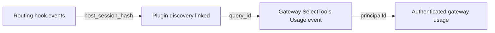

# Plugin telemetry correlation

Decision date: 2026-09-16.

## Goal

Make the plugin's routing observations cross-referenceable with authenticated
gateway usage without creating a device identity or sending conversation
content.

The correlation is intentionally partial. It covers conversations where
`Arcade_SelectTools` successfully returns a `query_id`.

## Correlation contract

| Event stream | Identity | Correlation properties |
| --- | --- | --- |
| Plugin hooks | Hashed host session | `host_session_hash`; discovery link also has `query_id` |
| Gateway Usage | Authenticated Arcade principal | `principalId`; plugin requests have `plugin_source`; successful SelectTools has `query_id` |

`Arcade_SelectTools` already returns an optional top-level `query_id`. The
plugin's post-tool hook extracts that value from the host's MCP result envelope
and emits `Plugin discovery linked` with the host session hash and query ID. The
gateway follow-up adds the same ID to the principal-attributed
`MCP tool recommendation queried` Usage event.

This supports an observed routing-to-discovery funnel and account-level usage.
It does not prove that routing caused a tool call.

## Plugin attribution

Generated MCP manifests send `Arcade-Plugin: arcade`. The gateway records it as
`plugin_source`, allowing Usage events from plugin connections to be filtered.

The manifests also send `Arcade-Plugin-Version`. `plugin_version` is useful for
debugging, but correlation and dashboards must not depend on it. Both headers
are client-declared analytics metadata, never authorization.

## Limits

- `query_id` can be absent when selection logging is unavailable. The hook and
  gateway still operate; that conversation is simply not cross-referenceable.
- Multi-task SelectTools returns the first nonempty task query ID. Treat it as a
  call-level bridge, not a unique ID for every recommendation.
- Direct app-tool calls have no SelectTools bridge. `plugin_source` still
  attributes their gateway usage to the plugin.
- Hook delivery is best effort. Missing link events are unknown coverage, not
  failed discovery.
- Host result envelopes differ. Verify extraction with a real SelectTools call
  in each supported host before relying on cross-host coverage.

## Privacy and identity

Hook events contain no prompts, tool arguments, tool results, paths, tokens,
emails, or error messages. `ARCADE_PLUGIN_TELEMETRY=0` disables hook telemetry.
It does not disable the gateway's existing operational or usage records.

Keep hook session hashes and gateway principals as separate identities. Join
events on `query_id`; do not alias a host session to an Arcade person. Skip
journey events when the host provides no session ID.

## Delivery

1. This plugin PR emits the routing events and SelectTools discovery link, and
   adds static plugin attribution headers.
2. The monorepo follow-up records `plugin_source` and the returned `query_id` on
   authenticated Usage events. See [gateway-telemetry-followup.md](gateway-telemetry-followup.md).
3. Run one real SelectTools call in Cursor, Claude Code, and Codex to confirm
   headers and hook result envelopes survive installation and authentication.

No proxy, persistent machine ID, hook-side tool outcome classifier, or PostHog
person aliasing is part of this design.
